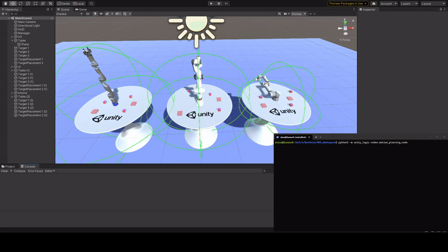
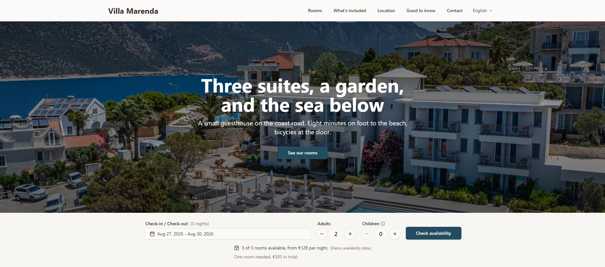
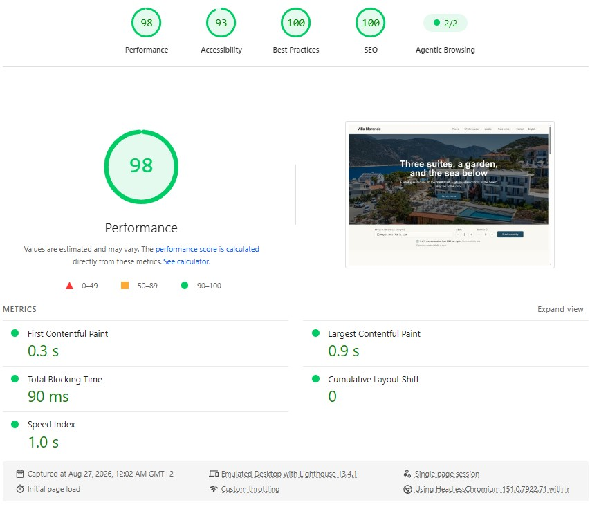

# Alexander Wiebe

**B.Sc. Computer Science · TU Berlin**

Beginner programmer and software developer. Learning through practical experience.

---

## About

I am a Computer Science student at TU Berlin, and fairly early in all of this.
Most of what I actually know, I learned by building something, breaking it, and
then figuring out why it broke.

My bachelor's thesis was a control and testing interface for robot arms in Unity
and ROS 2, designed to work with any manipulator that ships a URDF description and
implemented and tested on the Franka Panda. It covers motion planning with MoveIt 2
and OMPL, trajectory execution, gripper control and a C#/Python bridge, and takes
user-written Python scripts as the workload. I wrote a pick-and-place routine as
the reference example.

These days I mostly build small things, on my own or together with a friend:
interactive 3D scenes with React Three Fiber and Three.js, website templates,
small visualisations of algorithms I wanted to understand properly. The 3D work
turned out to be a nice surprise, because the same problems I met in simulation
(geometry, camera control, level of detail, frame budgets) show up again in the
browser, just with far less performance to spend.

I use AI coding assistants every day, for pair programming, code review and quick
prototyping. I treat generated code the way I treat any other contribution: read
it, verify it, and rewrite whatever does not hold up. It speeds me up, it does not
think for me.

Right now I am generally trying to find my footing in this field.

---

## Tech stack

**Robotics and simulation**

**Real-time 3D**

**Languages**

**Web and frontend**

**Tools**

---

## Projects

### Forest Road

An interactive night forest scene, built as a 3D site menu. Procedural terrain driven by a height function, 2600 instanced spruce trees rendered in one draw call with a GPU wind shader, positional audio synthesized entirely in the Web Audio API without a single sound file, and a graphics quality switch that scales render resolution and post-processing for weaker machines.

### Bachelor's Thesis: Universal Robot Control Interface

A control and testing interface for robot arms, built against a manipulator's URDF description rather than against one specific robot, so a new arm can be loaded from its own URDF. Implemented and tested on the Franka Panda. Motion planning through MoveIt 2 and OMPL, full gripper control, and a C#/Python bridge connecting Unity to ROS 2. Tasks are driven by Python scripts on the ROS side; a pick-and-place routine ships as the reference example.

### Coastal Guesthouse Template

A bilingual booking site for a small hotel, built as a reusable template. Server-side i18n with next-intl and no locale flash, a custom availability engine that matches guests to room combinations and prices them by season, accessible dialogs and forms validated with Zod.

Lighthouse audit, production build via PageSpeed Insights

### Algorithms and numerical methods

| Repository                                                                              | What it demonstrates                                                                                                                                                                        |
| --------------------------------------------------------------------------------------- | ------------------------------------------------------------------------------------------------------------------------------------------------------------------------------------------- |
| [**sorting-algorithms**](https://github.com/wiebe-alexander/sorting-algorithms)         | Bubble, selection, insertion, merge, quick and heap sort in C, with animated GIFs rendered by a Python recorder. The architecture keeps the C algorithms free of any graphics dependencies. |
| [**pathfinding-algorithms**](https://github.com/wiebe-alexander/pathfinding-algorithms) | BFS, Dijkstra, Greedy Best-First and A* on a grid, plus RRT and RRT* in continuous space. Rendered to GIFs using only the JDK. The same family of sampling-based planners that OMPL uses inside MoveIt.    |
| [**numerical-methods**](https://github.com/wiebe-alexander/numerical-methods)           | Interpolation (Runge phenomenon, cubic splines), FFT from scratch against an O(N²) DFT, and gradient descent / Newton on the Rosenbrock function. All verified against NumPy references.    |
